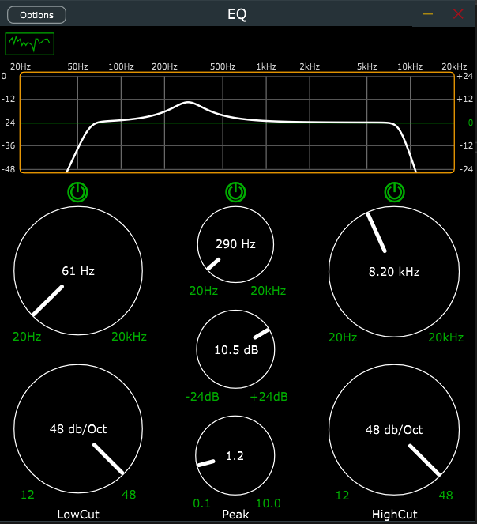

# Автоматизированное рабочее место специалиста
## Постановка задачи
Реализовать автоматизированное рабочее место специалиста (АРМ) - битмейкера (музыкального продюсера). АРМ представлено в виде эквалайзера.

АРМ должно выполнять функции:
- Визуализация частотного спектра.
- Срез низких и высоких частот.
- Срез пиковой частоты.

## Анализ задачи
- Создание приложения выполнялось с использованием кроссплатформенного фреймворка JUCE на языке C++. С помощью встороенных класов JUCE проводилась работа с получением, обработкой и выводом аудиоданных.
- Обработка аудиосигнала происходит в реальном времени с возможностью выбора частоты дискретизации и размера аудиобуфера.
- Так же присутствует гибкая настройка эквалайзера с возможностью отключения элементов управления.

## Тестирование
Тестирование программы представленно в видео на YouTube: [https://youtu.be/MOZ47426eUI](https://youtu.be/MOZ47426eUI)

## Сборка и запуск
Для того, чтобы запустить данную программу необходимо скачать zip архив и разархивировать папку ```EQ``` на накопитель компьютера. 
Далее установать фреймворк ```JUCE v7.0.5``` или более позднюю версию. Открыть ```JUCE```, создать проект ```Audio```, подключить нужные библиотеки вручную (находятся в списке modules при создании проекта), если они не были добавлены автоматически. Далее нужно заменить файлы в папке ```Source``` в созданном проекте, которые должны быть взяты из разархивированного zip архива из папки ```Source```. Теперь можно скомпилировать программу.

## Работа программы 



## Исходный код
Исходный код представлен в репозитории: https://github.com/Karrton/Creative-tasks/tree/main/EQ
