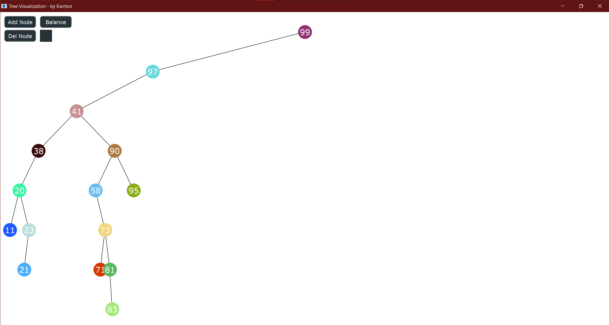
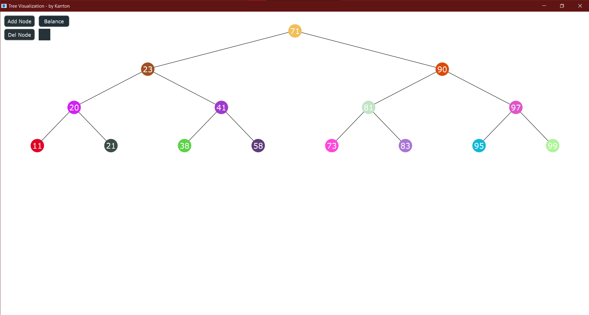

# Бинарные деревья поиска
## Постановка задачи
Реализовать бинарное дерево поиска.
- Создать класс ```BinaryTreeView``` и реализовать методы по редактированию дерева.
- Реализовать визуализацию дерева.
- Продемонстрировать решение задачи.

## Анализ задачи
- ```BinaryTreeView``` содержит методы редактирования дерева, а также его отрисовки.
- Класс отрисовки и обработки ввода - ```BinaryTreeView```, основан на ряде функций по настройке окна, отрисовке дерева, обработки ввода.
- Удаление элемента присходит через получение информации из поля ввода. 

## Сборка и запуск
Для того, чтобы запустить данную программу необходимо скачать zip архив и разархивировать папку ```Tree``` на накопитель компьютера. 
Далее открыть файл ```Tree\Builds\VisualStudio2022\Creative_1.sln``` и скомпилировать программу. Для корректного запуска необходима версия ```JUCE v7.0.5``` или более поздняя.

## Работа программы



## Балансировка дерева



## Исходный код
Исходный код представлен в репозитории: https://github.com/Karrton/Creative-tasks/tree/main/Graph/Source
